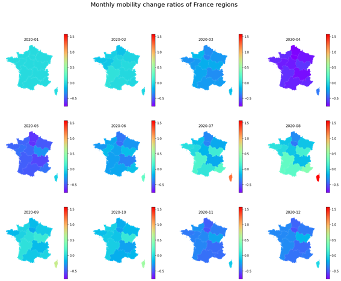
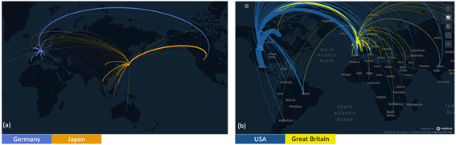

# Exmaples of REST_API of ODT Flow Explorer

[ODT Flow Explorer: Extract, Query, and Visualize Global Human Mobility](http://gis.cas.sc.edu/GeoAnalytics/od.html)


# Tutorial for REST APIs of ODT Explorer
You can learn how to use APIs to access the cube data in [Tutorial_RESTAPI_ODT_Explorer.ipynb](https://github.com/gladcolor/GIBD_RESTAPI/blob/main/Tutorial_RESTAPI_ODT_Explorer.ipynb).


# Case study: Find COVID-19's spatial impacts on mobility in France
This [case study](https://github.com/gladcolor/GIBD_RESTAPI/blob/main/ODT_case_study_France.ipynb) shows how to use APIs to extract intra-flows of 13 French administrative regions then make monthly maps.



# Case study: Connectivity of countries in 2019
This [case study](https://github.com/gladcolor/GIBD_RESTAPI/blob/main/ODT_case_study_country_connectivity.ipynb) shows a way to investigate connectivity between countries using a mobility representation. An interative mapping library named [Keplergl](www.kepler.gl) is used to visulize the flows.


# Install keplergl Python library in Windows

-- install GDAL, Shapely, and Fiona

Go go this [site](https://www.lfd.uci.edu/~gohlke/pythonlibs) and download the version your need. Then install these .whl files using:

```python
pip install GDAL_your_version.whl
pip install Shapely_your_version.whl
pip install Fiona_your_version.whl
```

If keplergl map does not show up in your Jupyter Notebook, see through this [post](https://www.gitmemory.com/issue/keplergl/kepler.gl/583/516724808).
 
The solution is:

1) Copy files in folder `C:\Users\GPU\AppData\Roaming\Python\Python37\site-packages\keplergl\static`  to `C:\ProgramData\Anaconda3\share\jupyter\nbextensions\keplergl-jupyter`
2) Copy file `keplergl-jupyter.json` to `C:\ProgramData\Anaconda3\etc\jupyter\nbconfig\notebook.d`

Please replace the paths accordingly.

You can use `jupyter --paths` to check where jupyter install extensions:

```
$ jupyter --paths
config:
    C:\Users\GPU\.jupyter
    C:\ProgramData\Anaconda3\etc\jupyter
    C:\ProgramData\jupyter
data:
    C:\Users\GPU\AppData\Roaming\jupyter
    C:\ProgramData\Anaconda3\share\jupyter
    C:\ProgramData\jupyter
runtime:
    C:\Users\GPU\AppData\Roaming\jupyter\runtime
```
This path `C:\ProgramData\Anaconda3\share\jupyter` is your `keplergl\static` files need to be copied to.


# Install GeoPandas in Winodow

Reference: Using geopandas on Windows[https://geoffboeing.com/2014/09/using-geopandas-windows/]

- download dependencies


 GDAL, rtree, pyproj, shapely, Fiona. (https://www.lfd.uci.edu/~gohlke/pythonlibs/#gdal)
 
 
- install cython in the base envrionment of Anaconda, then install the dependencies manually in Anaconda base environment.

``` conda install -c anaconda cython ```

``` pip install GDAL***.whl ```

- install geopandas

```pip install geopandas```
